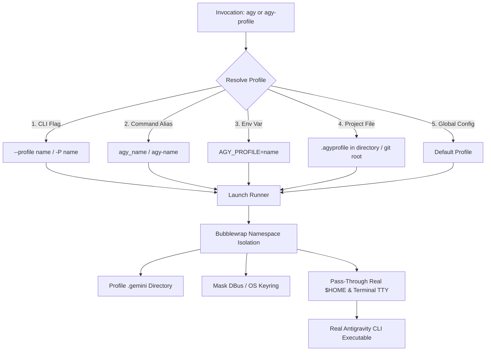

# Multi-AGY: Multi-Account Profile Manager for Google Antigravity CLI

[](https://github.com/sudhir-asuracore/multi-agy/actions/workflows/ci.yml)
[](https://opensource.org/licenses/MIT)
[](https://www.python.org/downloads/)
[]()

Multi-AGY is a lightweight, zero-dependency profile manager and smart CLI dispatcher for Google Antigravity CLI (`agy`). It enables seamless management and concurrent usage of multiple authenticated Google Antigravity Pro and Work accounts on Linux without token collisions, credential overwrites, or manual logouts.

---

## Features

- **True Process and Session Isolation**:
  - Leverages unprivileged Linux user namespaces via `bwrap` (Bubblewrap) to mount each profile's dedicated `.gemini` folder to `~/.gemini` strictly for that command session.
  - Automatically isolates DBus session sockets and GNOME Keyring daemon instances so multiple accounts never overwrite each other.
  - Your `$HOME`, shell config, `.ssh` keys, `.gitconfig`, and local files remain 100% native and untouched. Zero root/sudo permissions needed.
- **Parallel Multi-Account Sessions**:
  - Run multiple terminal tabs or background workflows using different Antigravity accounts at the exact same time.
- **Flexible Account Switching**:
  - **Direct CLI Flag**: `agy --profile <name>` or `agy -P <name>`
  - **Command Alias Shims**: `agy_work`, `agy_personal`, `agy-client`
  - **Project Auto-Switching**: Place `.agyprofile` in a directory or git repository to automatically bind that project to an account.
  - **Environment Variable**: `export AGY_PROFILE=work`
  - **Global Fallback**: Set your global default with `agy-profile default <name>`.
- **Profile Management CLI**:
  - Manage accounts with `agy-profile list`, `create`, `login`, `whoami`, `bind`, `sync-config`, `rename`, and `delete` (with automatic zip backups).
- **Configuration Syncing**:
  - Selectively share custom skills, rules, and MCP server configurations across profiles while keeping OAuth credentials completely isolated.

---

## How It Works



---

## Installation and Quick Start

### 1. Prerequisites
- Linux / Ubuntu (with `bubblewrap` installed: `sudo apt install bubblewrap`)
- Python 3.8+
- Google Antigravity CLI (`agy`) installed in `~/.local/bin`

### 2. Clone and Install
```bash
git clone https://github.com/sudhir-asuracore/multi-agy.git
cd multi-agy
make install
```
This automatically:
1. Safely preserves your existing `agy` binary as `~/.local/bin/agy-real`.
2. Installs the smart `agy` dispatcher wrapper.
3. Installs the `agy-profile` management CLI.
4. Auto-migrates your active account into a `personal` profile.
5. Generates shortcut shims (`agy_<name>`).

---

## Usage Guide

### 1. Add a New Profile and Authenticate
```bash
# Create a new profile
agy-profile create work --description "Work Pro Account"

# Authenticate via browser OAuth
agy-profile login work
```

### 2. View Profiles and Accounts
```bash
agy-profile list
```
Output:
```text
ACTIVE       PROFILE   ACCOUNT EMAIL            DEFAULT  STATUS         LAST USED 
-----------  --------  -----------------------  -------  -------------  ----------
* (current)  personal  sidigridghost@gmail.com  yes      authenticated  2026-09-01
             work      developer@company.com    no       authenticated  2026-09-01
```

### 3. Running `agy` with Different Accounts

#### Option A: Direct CLI Flag
```bash
agy --profile work -p "Explain this codebase"
agy -P personal --mode plan
```

#### Option B: Direct Command Shortcut
```bash
agy_work
agy_personal
```

#### Option C: Project Directory Auto-Binding
Inside your project or git repository:
```bash
cd ~/IdeaProjects/work-repo
agy-profile bind work
```
Now, simply running `agy` anywhere inside `~/IdeaProjects/work-repo` will automatically use your `work` profile.

#### Option D: Inspect Active Context
Check which profile is active in your current working directory:
```bash
agy-profile whoami
```

---

## CLI Reference (`agy-profile`)

| Command | Description |
| :--- | :--- |
| `agy-profile list` (or `ls`) | List all profiles, active status, emails, and defaults |
| `agy-profile whoami` | Show resolved profile and account for current working directory |
| `agy-profile create <name>` | Create a new isolated profile |
| `agy-profile login <name>` | Log in to a profile via browser OAuth |
| `agy-profile default [name]` | Get or set the default fallback profile |
| `agy-profile bind <name>` | Bind current directory (or git repo) to a profile via `.agyprofile` |
| `agy-profile unbind` | Remove project binding |
| `agy-profile import <name>` | Import existing `~/.gemini` directory into a named profile |
| `agy-profile rename <old> <new>` | Rename an existing profile |
| `agy-profile delete <name>` | Delete a profile (creates a timestamped zip backup) |
| `agy-profile sync-config <src>` | Synchronize settings and MCP configurations across profiles |
| `agy-profile install-shims` | Refresh `agy_<name>` alias symlinks in `~/.local/bin` |

---

## Shell Completion (Bash / Zsh)

### Bash
Add to your `~/.bashrc`:
```bash
source <path-to-multi-agy>/completions/agy-profile.bash
```

### Zsh
Add to your `~/.zshrc`:
```zsh
fpath=(<path-to-multi-agy>/completions $fpath)
autoload -Uz compinit && compinit
```

---

## Testing

Run the automated test suite:
```bash
make test
# or
python3 -m unittest discover -s tests -p "test_*.py" -v
```

---

## License

This project is licensed under the [MIT License](LICENSE).
